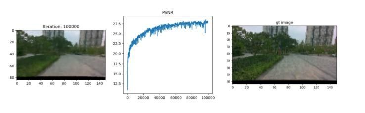
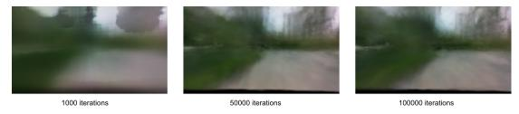

# NeRF: Neural Radiance Fields
### [Project Page](http://tancik.com/nerf) | [Video](https://youtu.be/JuH79E8rdKc) | [Paper](https://arxiv.org/abs/2003.08934) | [Data](https://drive.google.com/drive/folders/128yBriW1IG_3NJ5Rp7APSTZsJqdJdfc1)
[](https://colab.research.google.com/github/bmild/nerf/blob/master/tiny_nerf.ipynb)<br>
Tensorflow implementation of optimizing a neural representation for a single scene and rendering new views.<br><br>
[NeRF: Representing Scenes as Neural Radiance Fields for View Synthesis](http://tancik.com/nerf)  
 [Ben Mildenhall](https://people.eecs.berkeley.edu/~bmild/)\*<sup>1</sup>,
 [Pratul P. Srinivasan](https://people.eecs.berkeley.edu/~pratul/)\*<sup>1</sup>,
 [Matthew Tancik](http://tancik.com/)\*<sup>1</sup>,
 [Jonathan T. Barron](http://jonbarron.info/)<sup>2</sup>,
 [Ravi Ramamoorthi](http://cseweb.ucsd.edu/~ravir/)<sup>3</sup>,
 [Ren Ng](https://www2.eecs.berkeley.edu/Faculty/Homepages/yirenng.html)<sup>1</sup> <br>
 <sup>1</sup>UC Berkeley, <sup>2</sup>Google Research, <sup>3</sup>UC San Diego  
  \*denotes equal contribution  
in ECCV 2020 (Oral Presentation, Best Paper Honorable Mention)


## TL;DR quickstart

To setup a conda environment, download example training data, begin the training process, and launch Tensorboard:
```
conda env create -f artifacts/docker/requirements_dev.yml
conda activate nerf
bash download_example_data.sh
python run_nerf.py --config config_fern.txt
tensorboard --logdir=logs/summaries --port=6006
```
If everything works without errors, you can now go to `localhost:6006` in your browser and watch the "Fern" scene train.

remote server
```
ssh -p 22 yeliu@cpu001.corp.deepmirror.com
cd /mnt/nas/share-map/experiment/liuye/dev/nerf
```

## What is a NeRF?

A neural radiance field is a simple fully connected network (weights are ~5MB) trained to reproduce input views of a single scene using a rendering loss. The network directly maps from spatial location and viewing direction (5D input) to color and opacity (4D output), acting as the "volume" so we can use volume rendering to differentiably render new views.

Optimizing a NeRF takes between a few hours and a day or two (depending on resolution) and only requires a single GPU. Rendering an image from an optimized NeRF takes somewhere between less than a second and ~30 seconds, again depending on resolution.

### Optimizing a NeRF

Run
```
bash scripts/download_example_data.sh
```

To optimize a low-res Fern NeRF:
```
python run_nerf.py --config paper_configs/config_fern.txt
```

To optimize a low-res Lego NeRF:
```
python run_nerf.py --config paper_configs/config_lego.txt
```

### Rendering a NeRF

Run
```
bash scripts/download_example_weights.sh
```
to get a pretrained high-res NeRF for the Fern dataset. Now you can use [`render_demo.ipynb`](https://github.com/bmild/nerf/blob/master/render_demo.ipynb) to render new views.

### Extracting geometry from a NeRF

Check out [`extract_mesh.ipynb`](https://github.com/bmild/nerf/blob/master/extract_mesh.ipynb) for an example of running marching cubes to extract a triangle mesh from a trained NeRF network. You'll need the install the [PyMCubes](https://github.com/pmneila/PyMCubes) package for marching cubes plus the [trimesh](https://github.com/mikedh/trimesh) and [pyrender](https://github.com/mmatl/pyrender) packages if you want to render the mesh inside the notebook:
```
pip install trimesh pyrender PyMCubes
```

### Test in DM data

* test with a walking straight forward session. with small image size in tiny nerf.


* test full nerf with higher resolution. failed to converge


## Citation

```
@inproceedings{mildenhall2020nerf,
  title={NeRF: Representing Scenes as Neural Radiance Fields for View Synthesis},
  author={Ben Mildenhall and Pratul P. Srinivasan and Matthew Tancik and Jonathan T. Barron and Ravi Ramamoorthi and Ren Ng},
  year={2020},
  booktitle={ECCV},
}
```
